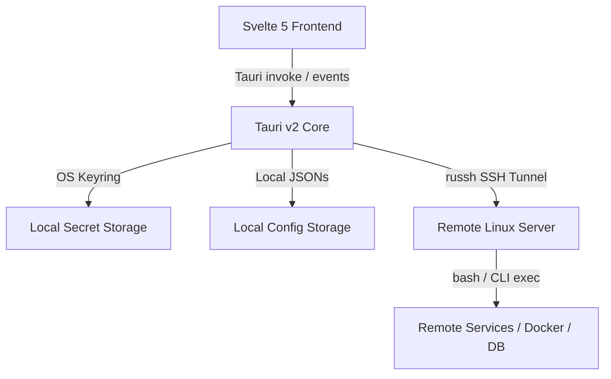

# Jarvis Server Manager

[](https://tauri.app/)
[](https://svelte.dev/)
[](https://www.rust-lang.org/)
[](#)

**Jarvis** is a powerful, secure, and modern desktop application for remote Linux server administration. Built as a Tauri v2 desktop application, it combines a highly responsive **Svelte 5** frontend with a high-performance **Rust** backend, allowing you to manage multiple Linux servers concurrently inside a custom, grid-resizable multi-pane workspace.

All remote server communications are handled over secure **SSH connections** (via the `russh` crate) and **SFTP subsystems** (via `russh-sftp`), ensuring that raw credentials are never transmitted insecurely and your management operations are entirely self-contained.

---

## Table of Contents

- [Key Features](#key-features)
- [Architecture & Tech Stack](#architecture--tech-stack)
- [Workspace & Grid Layout](#workspace--grid-layout)
- [Security & Credentials Management](#security--credentials-management)
- [Configuration Directory & Files](#configuration-directory--files)
- [Database Client Tunneling](#database-client-tunneling)
- [Zero-Trust Reverse Proxy (Pangolin)](#zero-trust-reverse-proxy-pangolin)
- [Local Development & Build Instructions](#local-development--build-instructions)

---

## Key Features

Jarvis contains 24+ administrative panels integrated into a single layout. Below is a catalog of the available tabs and their underlying mechanics:

| Tab Name | Tab ID | Backend Operations & Commands Used |
| :--- | :--- | :--- |
| **Dashboard** | `dashboard` | Aggregates system metrics using `uptime`, memory utilization, network traffic (`/proc/net/dev`), and disk usage. Shows real-time graphs and links to resource alerts. |
| **Maintenance** | `maintenance` | Checks for upgrades (`/var/run/reboot-required`), runs package updates (`apt-get update`), upgrades (`apt-get upgrade -y`), and handles safe server `reboot` sequences. |
| **Backups** | `backups` | Manages tarball and SQL backup templates. Deploys local cron jobs that can push backups to AWS S3, SFTP remotes, or local destinations. |
| **Restic Backups** | `restic` | Configures and monitors [Restic](https://restic.net/) repositories (Local, S3, SFTP, Backblaze B2, REST, Rclone). Supports snapshot browsing, restoring, and direct file downloads. |
| **Network / Ports** | `network` | Lists active TCP listening ports and processes using `ss -tulpn` or `netstat -tulpn`. Shows active sockets (`ss -tn state established`). |
| **Runbooks** | `runbooks` | Saves custom shell scripts to execute on the remote host with one click (with or without sudo). Outputs run sequences in real-time streams. |
| **Files (SFTP)** | `files` | A fully-featured SFTP client. Supports folder browsing, downloads/uploads (with speed and cancellation), drag-and-drop, chmod, and built-in file editing. |
| **Services (Systemd)** | `services` | Inspects systemd service unit status. Start, stop, restart, enable, or disable units. Allows creating new systemd service files. |
| **Docker** | `docker` | Inspects system containers, images, volumes, and networks. Streams container logs, spawns container terminals, manages docker-compose projects, and provides a **Volume Browser** to edit files inside volumes. |
| **Tasks (Cron)** | `cron` | Views, edits, installs, and parses system crontabs. Integrates with the backend to write safely to the user's remote crontab files. |
| **Users** | `users` | Manages server users and groups. Add/delete users, create/delete groups, change passwords, and manage group memberships by editing `/etc/passwd` and `/etc/group` safely. |
| **Firewall** | `firewall` | Manages network security by controlling **UFW** rules (enable/disable, allow/deny/limit ports) and **iptables** policies/chains (INPUT, FORWARD, OUTPUT). |
| **CrowdSec** | `crowdsec` | Connects to [CrowdSec](https://www.crowdsec.net/) to monitor security alerts, view registered bouncers, inspect scenarios/parsers, and manage bans/decisions (`cscli`). |
| **Pangolin Proxy** | `pangolin` | Manages Zero-Trust network configurations, site tunnels, public domains, role mappings, and charts geolocation analytics via the Pangolin API. |
| **Logs** | `logs` | Streams system log files (`auth.log`, `syslog`, `dmesg`) and `journalctl` output. Displays active SSH sessions (`w`/`who`) and allows terminating session TTYs (`pkill -9 -t`). |
| **Log Analysis** | `loganalysis` | Runs an efficient bash pipeline (`awk`, `sort`, `uniq`) to generate request distributions (status codes, UA, IPs, paths) from Nginx, Apache, or Traefik log files/docker logs. |
| **Terminal** | `terminal` | Spawns an interactive PTY session directly inside the remote host using custom SSH channels, rendering in the frontend via xterm.js. |
| **Disk Management**| `disks` | Manages remote filesystems. Lists block devices (`lsblk`), mounts/unmounts partitions, runs filesystem checks (`fsck`), and expands filesystems (`resize2fs`). |
| **Nginx Manager** | `webserver` | Configures Nginx virtual hosts, reverse proxies, and SSL certificates (integrating custom keys or certbot for Let's Encrypt). |
| **Processes** | `processes` | Shows processes sorted by resource consumption (`ps -eo pid,user,pcpu,pmem,ni,args`). Supports terminating (`kill -9`) and renicing (`renice`) processes. |
| **Databases** | `database` | An Adminer-like client. Establishes secure local port forwarding tunnels to remote MySQL/PostgreSql databases (even if host-restricted or in Docker containers). |
| **Env Variables** | `envvars` | Displays environment variables on the remote host (`printenv`) or inside a running Docker container (`docker inspect`). |
| **Net Diagnostics**| `netdiag` | Diagnoses remote connectivity issues. Performs `ping`, `traceroute`/`tracepath`, `dig` DNS lookups, `curl` HTTP tests, `mtr`, and `nc` port checks from the remote host. |
| **Systemd Timers** | `timers` | Lists, enables, disables, starts, and stops systemd timer units (`systemctl list-timers --all`). |

---

## Architecture & Tech Stack

Jarvis relies on a strict split-responsibility pattern:



### Frontend
- **Svelte 5 Runes**: Core state management resides globally using `$state`, `$derived`, and `$effect` rules, bypassing old Svelte 4 store patterns.
- **Xterm.js**: Renders responsive terminal emulators coupled with the `@xterm/addon-fit` addon to track grid resizing dynamically.
- **Monaco Editor**: Provides a rich text editor experience for modifying Nginx configs, Docker compose files, and volume files.
- **Grid Layout**: Workspace sheets are divided into up to 4 panes running on a dynamic `120x120` CSS grid system.

### Backend
- **Tauri v2**: Harnesses native webview windows, OS integration, and tray behaviors.
- **russh**: An asynchronous Rust SSH implementation. Establishes robust connections, handles private key credentials, known hosts, and spawns PTY execution shells.
- **Local Port Forwarding Tunnels**: Used by the Database explorer to forward MySQL and PostgreSQL connections to a local port in Rust, binding query executions securely using SQLx.
- **OS Keyring (`keyring-rs`)**: Passes sensitive passwords, key passphrases, and tokens directly to the operating system's vault, keeping the local config files clean of secrets.

---

## Workspace & Grid Layout

The workspace supports splitting into up to **4 distinct panes** arranged on a 120×120 CSS grid coordinate system.
- Panes can be split horizontally or vertically.
- Resize handles can be dragged to dynamically adjust the grid sizing.
- Tabs can be rearranged or moved to other panes via Drag-and-Drop.
- Component back navigation is handled uniformly via `src/lib/backNavigation.svelte.ts` which intercepts mouse button 3 (Back) or the workspace back buttons.

---

## Security & Credentials Management

### Sudo Password Flow
To protect system files and root commands, Jarvis uses a secure, cached sudo flow:
1. When a remote command requires sudo, it runs the command with sudo.
2. If it catches the error code `SUDO_PASSWORD_REQUIRED` from the backend, the frontend intercepts it and overlays the `SudoModal`.
3. The password is submitted and cached in `AppState` in-memory.
4. **Timeout**: The cached sudo password automatically expires and clears after **900 seconds (15 minutes)**.
5. **Lockout**: To prevent brute forcing, incorrect sudo entries are checked. If there are **5 consecutive failures**, the sudo password flow locks out the user for **60 seconds** (`SUDO_RATE_LIMITED`).

### OS Keyring Storage
No plain text secrets (SSH passwords, private key passphrases, DB passwords, S3 keys, or API tokens) are saved to config files. They are stored in your OS-native keyring (Credential Manager on Windows, Keychain on macOS, Secret Service on Linux).

Here is the exact map of keyring services and keys:

| Keyring Service Name | Key / Account Identifier | Stores |
| :--- | :--- | :--- |
| `"JarvisServerManager"` | `{profile_id}_pass` | SSH Password for host connection |
| `"JarvisServerManager"` | `{profile_id}_passphrase` | Passphrase for the SSH Private Key file |
| `"JarvisBackupDB"` | `{template_id}` | Database connection password for Backup templates |
| `"JarvisBackupDest"` | `{template_id}-access` | Access key (AWS S3) or User (SFTP) for backup templates |
| `"JarvisBackupDest"` | `{template_id}-secret` | Secret key (AWS S3) or Password (SFTP) for backup templates |
| `"JarvisResticSecrets"` | `{repo_id}-password` | Repository passphrase for the Restic repo |
| `"JarvisResticSecrets"` | `{repo_id}-access` | AWS Access Key / Backblaze Application Key for Restic repo |
| `"JarvisResticSecrets"` | `{repo_id}-secret` | AWS Secret Key / Backblaze Application Key ID for Restic repo |
| `"JarvisPangolin"` | `"api_key"` | Global API Key for Zero-Trust Pangolin Proxy integration |

---

## Configuration Directory & Files

The configurations are written to the application's configuration directory:
- **Windows**: `%APPDATA%\com.jarvis.servermanager\`
- **Linux**: `~/.config/com.jarvis.servermanager/`
- **macOS**: `~/Library/Application Support/com.jarvis.servermanager/`

### 1. `profiles.json`
Stores the remote server connection metadata (excluding credentials).
```json
[
  {
    "id": "e229c15a-49c9-43c2-bf72-a721d58d929f",
    "label": "Production Web Server",
    "host": "192.168.1.50",
    "port": 22,
    "username": "admin",
    "auth_type": "key",
    "key_path": "/home/user/.ssh/id_ed25519"
  }
]
```

### 2. `profile_extras.json`
Contains non-sensitive metadata for profiles, such as custom runbooks, backup schedules, Restic repository structures, and alert thresholds.
```json
{
  "e229c15a-49c9-43c2-bf72-a721d58d929f": {
    "runbooks": [
      {
        "id": "rb-1",
        "name": "Flush Redis Cache",
        "command": "redis-cli flushall",
        "use_sudo": true
      }
    ],
    "backup_templates": [
      {
        "id": "tpl-1",
        "name": "App Directory Daily Backup",
        "backup_type": "files",
        "source_path": "/var/www/app",
        "destination": "s3",
        "dest_endpoint": "https://s3.amazonaws.com",
        "dest_region": "us-east-1",
        "dest_bucket": "app-backups-bucket",
        "dest_path": "/daily/",
        "schedule_enabled": true,
        "schedule_cron": "0 2 * * *"
      }
    ],
    "restic_repos": [
      {
        "id": "repo-1",
        "name": "Offsite S3 Repo",
        "repo_type": "s3",
        "path_or_url": "s3:https://s3.amazonaws.com/app-restic-repo",
        "use_sudo": false
      }
    ],
    "alert_thresholds": {
      "enabled": true,
      "disk_pct": 85,
      "ram_pct": 90,
      "cpu_pct": 95
    }
  }
}
```

### 3. `pangolin_config.json`
Stores the global zero-trust reverse proxy endpoint and organization settings.
```json
{
  "api_url": "https://api.pangolin.net",
  "org_id": "org_71afc823_9bce_4210"
}
```

### 4. `known_hosts`
Standard SSH public keys file. Remote keys are verified upon first connection and stored here to protect against Man-in-the-Middle (MitM) attacks.

---

## Database Client Tunneling

When you connect to a remote database (MySQL or PostgreSQL) via the **Databases** (`database`) panel:
1. Jarvis establishes a dynamic TCP port forward tunnel over the active SSH channel to the target database host (e.g. `localhost` on the remote server, or a Docker container's private IP on its Docker network bridge).
2. The Rust backend binds to a random local port on `127.0.0.1`.
3. It initializes an SQLx connection pool referencing the forwarded local port.
4. All CRUD operations, column introspection, and query requests are run over this secure tunnel, avoiding exposing database ports to the public internet.

---

## Zero-Trust Reverse Proxy (Pangolin)

Jarvis integrates with a Pangolin Zero-Trust Reverse Proxy daemon:
- Analyzes incoming traffic, allowed and blocked requests, and maps visitor country statistics.
- Connects using a secure API Key stored in your keyring (`JarvisPangolin`).
- Configures tunnels, proxy rules, access permissions, invites users, and configures role-based access control directly from the user interface.

> [!IMPORTANT]
> To use the Pangolin control panel, you must first configure and run the Pangolin API on your remote server. Follow the self-hosting and configuration guides here: [Pangolin API Integration Documentation](https://docs.pangolin.net/self-host/advanced/integration-api).

---

## Local Development & Build Instructions

### Remote Server Requirements
For all tabs to operate fully, the remote Linux server should have the following tools/packages installed:
- **Core Diagnostics**: `ss` / `netstat`, `ps`, `curl`, `nc` (netcat), `traceroute` / `tracepath`, `dig` / `nslookup`.
- **Docker Management**: `docker` & `docker-compose`.
- **Restic Backups**: `restic` (Jarvis offers a one-click installation helper via apt if not present) and optionally `rclone` (for cloud remote discovery).
- **Firewall**: `ufw` (for rule lists and toggle capabilities).
- **Security Audit**: `crowdsec` (needed for active security/bans overview).
- **Nginx Manager**: `nginx` (to list, reload, and configure proxy hosts).

### Local Prerequisites
1. **Rust & Cargo**: Make sure you have Rust (v1.75+) installed on your development machine.
2. **Node.js & npm/pnpm**: Install Node.js (v18+) and pnpm.
3. **OS Packages (Linux only)**: If building or running on Linux, install Tauri's system dependencies:
   ```bash
   sudo apt-get install -y libwebkit2gtk-4.1-dev build-essential curl wget file libssl-dev libgtk-3-dev libayemu-dev libayatana-appindicator3-dev
   ```

### Command Reference

Install dependencies:
```bash
pnpm install
```

Start the application in development mode (spawns both SvelteKit and Tauri v2 window):
```bash
pnpm tauri dev
```

Start the frontend development server only (runs in the browser at http://localhost:1420):
```bash
pnpm dev
```

Run static code type checking on the frontend:
```bash
pnpm check
```

Compile and package the application into a production installer:
```bash
pnpm tauri build
```

> [!NOTE]
> The dev script automatically runs the Svelte compiler and watches file updates. If you modify translations, types are automatically synchronized.
